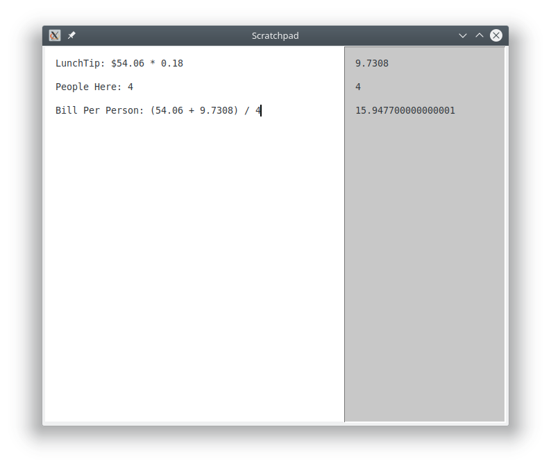

# scratchpad
Basic notepad app with some built in calculator functions written in python using Tkinter.

Scratchpad can be used for notetaking and will automatically perform in-line math while you type.  For those interested, it basically finds any mathematical looking questions and throws them into python.

  

### Supported Operations

* &nbsp;&nbsp; \+ &nbsp;&nbsp;&nbsp;&nbsp;(_addition_)
* &nbsp;&nbsp; \- &nbsp;&nbsp;&nbsp;&nbsp; (_subtract_)
* &nbsp;&nbsp; / &nbsp;&nbsp;&nbsp;&nbsp; (_divide_)
* &nbsp;&nbsp; \* &nbsp;&nbsp;&nbsp;&nbsp; (_multiply_)
* &nbsp;&nbsp; ** &nbsp;&nbsp;&nbsp;&nbsp; (_exponent_)
* &nbsp;&nbsp; () &nbsp;&nbsp;&nbsp;&nbsp; (_order of operations enforced by parenthesis_)
* &nbsp;&nbsp; == &nbsp;&nbsp;&nbsp;&nbsp; (_comparison, as in 6 == 2 * 3 => true_)

### How to install / run
#### Using this github repo / source code
Just download (clone or otherwise) everything here and run

`python3 scratchpad.py`

\-_or_\-

`./scratchpad.py`

#### Using PyPi package repo

`pip3 install scratchpad-deadmund`

`python3 -m scratchpad`

#### Generate a .deb and install that
(_still waiting to get package listed in Ubuntu_)

`cd scratchpad/debian-packaging/`

`debuild --no-tgz-check`

`cd ../`

`sudo dpkg -i scratchpad_1.1_all.deb`

_then to run_

`scratchpad`

#### Generate a pypi package and install that

`cd scratchpad/pypi-packaging`

`python3 setup.py sdist bdist_wheel`

`pip3 install dist/*`

_then to run_

`python3 -m scratchpad`

[//]: # The tool chain you need is pip3 install twine, setuptools, wheel, mkpkg
[//]: # To check for mistakes in package use:  python3 -m twine check dist/*
[//]: # To install it locally  (without pypi):  pip3 install dist/*
[//]: # To upload it:  python3 -m twine upload dist/*
[//]: # This might prove useful:  python3 -m mkpkg --cli scratchpad.py scratchpad